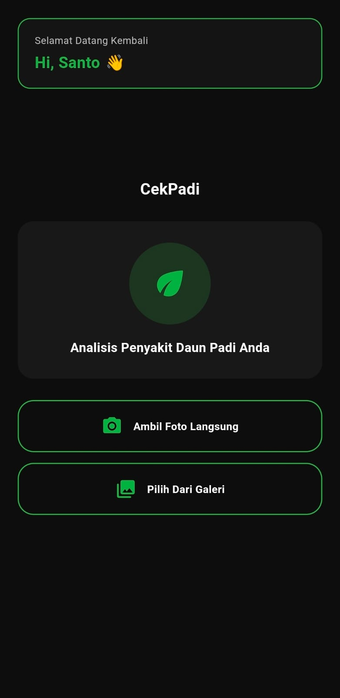
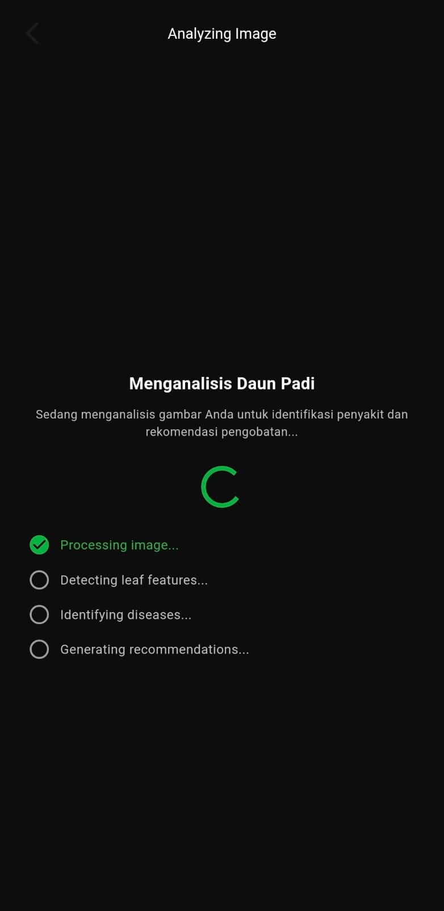
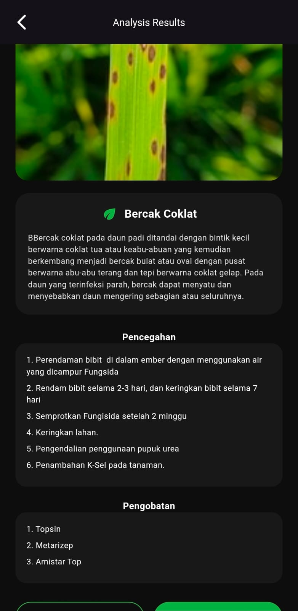

# CekPadi – Paddy Leaf Disease Classification 🌾

CekPadi adalah aplikasi berbasis **mobile** yang dirancang untuk membantu petani, peneliti, dan praktisi pertanian dalam **mengklasifikasikan penyakit daun padi** secara otomatis menggunakan pendekatan **Deep Learning**.  
Aplikasi ini memanfaatkan arsitektur **EfficientNetV2** untuk mengenali berbagai jenis penyakit daun padi dari citra digital yang diunggah atau diambil secara langsung melalui kamera perangkat.

---

## 🎯 Tujuan Proyek

Tujuan utama dari proyek ini adalah:
- Mengembangkan sistem klasifikasi penyakit daun padi berbasis citra digital
- Membantu deteksi dini penyakit tanaman padi secara cepat dan akurat
- Mengimplementasikan model **Deep Learning EfficientNetV2** ke dalam aplikasi mobile
- Meningkatkan efisiensi dan akurasi dalam identifikasi penyakit tanaman di sektor pertanian

---

## 🌱 Kelas Penyakit yang Dideteksi

Model CekPadi mampu mengklasifikasikan **6 kelas**, yaitu:

| No | Kelas |
|----|------|
| 1 | Bacterial Leaf Blight |
| 2 | Sheath Blight |
| 3 | Leaf Blast |
| 4 | Brown Spot |
| 5 | Narrow Brown Spot |
| 6 | Healthy Leaf (Daun Padi Sehat) |

---

## 📱 Fitur Utama Aplikasi

- 📸 **Ambil gambar secara langsung** melalui kamera perangkat
- 🖼️ **Unggah gambar daun padi** dari galeri
- 🧠 **Klasifikasi otomatis** menggunakan model Deep Learning
- 📊 Menampilkan **Jenis Penyakit, Deskripsi Penyakit, Pencegahan dan Pengobatan**
- ⚡ Proses inferensi cepat dan efisien untuk penggunaan mobile

---

## 🧠 Arsitektur Model

Proyek ini menggunakan arsitektur **EfficientNetV2**, yang merupakan pengembangan dari EfficientNet dengan peningkatan pada:
- Kecepatan training
- Stabilitas pada model berukuran besar
- Efisiensi komputasi
- Akurasi klasifikasi yang lebih tinggi

### Ringkasan Arsitektur:
- Backbone: **EfficientNetV2**
- Pendekatan: **Image Classification**
- Input: Citra daun padi (RGB)
- Output: Kelas penyakit, deskripsi penyakit dan pencegahan + pengobatan

---

## 🛠️ Teknologi yang Digunakan

### Machine Learning & Backend
- Python
- TensorFlow / Keras
- EfficientNetV2
- NumPy
- OpenCV

### Mobile Application
- Model deployment menggunakan **TensorFlow Lite (.tflite)**
- Akses kamera dan galeri gambar
- Inferensi langsung di perangkat (on-device inference)

---

## 📱 Tampilan Aplikasi

---

## 🚀 Alur Sistem

1. User mengambil atau mengunggah gambar daun padi
2. Gambar diproses (resize, normalisasi)
3. Model EfficientNetV2 melakukan inferensi
4. Sistem menampilkan:
   - Jenis penyakit
   - Deskripsi Penyakit
   - Pencegahan dan Pengobatan

---

## 📜 Lisensi

Proyek ini dikembangkan untuk keperluan akademik dan penelitian.  
Silakan gunakan dan kembangkan lebih lanjut dengan tetap mencantumkan atribusi yang sesuai.

---

## 👨‍💻 Pengembang

- **Wika Romauli Siregar**
- **Lasro P. N. Tamba**
- **Santo Martogi Simangunsong**

D3 Teknologi Informasi

Institut Teknologi Del

Fokus: Machine Learning, Computer Vision, Mobile Application Development

---

## 🌾 Penutup

CekPadi diharapkan dapat menjadi langkah awal menuju pemanfaatan teknologi **Artificial Intelligence** dalam mendukung pertanian modern, khususnya dalam mendeteksi dan menangani penyakit tanaman padi secara lebih cepat dan akurat.

